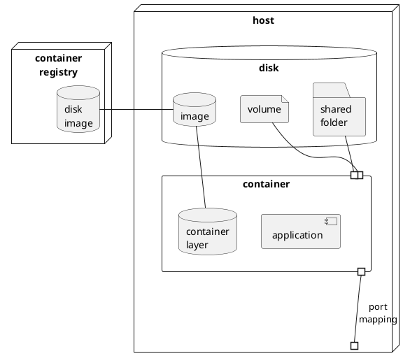

Intro to Docker
===============
8 часов, 2 ак. дня.

Prerequisites
=============
- [ ] RAM ≥ 4Gb
- [ ] RHEL8
- [ ] Права локального админа для аккаунта участника {{ account }}
- [ ] Доступен корпоративный Docker {{ registry-host }} `artifactory.raiffeisen.ru`
- [ ] Доступен корпоративный Docker {{ soft-registry }} с образами прикладного ПО `{{ registry-host }}/ext-rbru-techimage-docker`
- [ ] Доступен корпоративный Docker {{ os-registry }} с образами ОС `{{ registry-host }}/ext-rbru-osimage-docker`
- [ ] Доступен корпоративный Docker {{ project-registry }} учебного проекта `{{ registry-host }}/training-docker`
- [ ] Доступен дистрибутив рабочего приложения {{ app-distr }} `{{ registry-host }}/artifactory/training-docker/dbo-1.0-SNAPSHOT.jar`
- [ ] Доступен исходный проект рабочего приложения {{ app-src }} `{{ registry-host }}/artifactory/training-docker/dbo-1.0-SNAPSHOT-sources.jar`
- [ ] Доступен необходимый компонент рабочего приложения {{ app-stub }} `{{ registry-host }}/artifactory/repo1-cache/com/github/tomakehurst/wiremock-standalone/2.27.2/wiremock-standalone-2.27.2.jar`
- [ ] Установлен DockerCE
```shell
sudo dnf install -y docker-ce
```

Agenda
======
7:20

Введение в Docker (15)
-----------------
- [ ] Зачем нужен Docker? Каковы функции инструментов контейнеризации?
- development environment
- testing environment
- production environment
- [ ] Метафора морского контейнера
- [ ] Виртуализация или контейнеризация?
- место на диске для гостевой ОС
- время запуска гостевой ОС
- overhead операций гостевой ОС
- [ ] Контейнер – процесс ОС "на стероидах": какие ресурсы необходимо изолировать и инкапсулировать?
- [ ] [Схема контейнеризации](docker/img/container.png)
- [dockerd](https://docs.docker.com/engine/reference/commandline/dockerd/)
- [docker cli](https://docs.docker.com/engine/reference/commandline/cli/)
- disk image provisioning tool (dockercli) and Dockerfile
- disk image
- disk image registries: [docker hub](http://hub.docker.com) and corporate registries
- container = process + container data (container layer)
<details>
<summary>puml</summary>


</details>

Hands-on practice quest #00: prerequisites sound-check (15+5)
---------------------------
- [ ] Given 
- сделан форк данного руководства для собственных пометок
- форк открыт в браузере для внесения пометок
- проставлены закладки или выписаны в notepad основные ресурсы раздела [Prerequisites](#Prerequisites)
- Hint: синонимы команд docker cli
- Hint: `... --help`
- Hint: [docker cli reference](https://docs.docker.com/engine/reference/commandline/docker/)
- сформированы пары участников с чередованием ролей в паре 


- [ ] When участники именуют сценарии, выполняют команды и анализируют их вывод и поведение
- Сценарий "Как ...?"
```shell
docker version # TODO: собственные пометки участников для будущего использования в проектах
docker system info
docker system df

cat $HOME/.docker/config.json
cat $HOME/.docker/daemon.json

docker events
```

- Сценарий "Как ...?" (в новом shell, чтобы параллельно видеть вывод `docker events`)
```shell
docker logout
docker login {{ registry-host }}
```

- Сценарий "Как ...?"
```shell
docker pull {{ soft-registry }}/postgres:11-alpine
docker system df
````

- Сценарий "Как ...?"
```shell
docker container ls [--all]
docker run --name demo -it {{ os-registry }}/alpine /bin/sh
/# cat /etc/os-release
/# exit 
```

- Сценарий "Как ...?"
```shell
docker container ls [--all]
docker rm [-f] demo
```

- [ ] Then участники делятся проблемами и отвечают на вопросы
- Как проименовали сценарии?
- Успешна ли сконфигурирована система для использования docker?
- Какая версия API?
- Откуда взялся образ диска?
- Сколько места занимает образ?
- Сколько места занимает контейнер?

Жизненный цикл готового образа (40)
------------------------------
### Образ
- [ ] Задача среды исполнения контейнеров: изоляция диска
- [ ] Отображение диска контейнера на диск хостовой системы: _образ_
- [ ] Что должно быть на диске для запуска и работы контейнеризованного приложения?
- [ ] Состав образа диска (от `scratch` до prod-ready)
- OS libraries
- OS executables
- Application libraries
- Application executables
- Config files
- Data files
```shell
$ docker run --rm -it alpine 
/ # ls
bin    dev    etc    home   lib    media  mnt    opt    proc   root   run    sbin   srv    sys    tmp    usr    var
```

### ЖЗЛ
- [ ] Идентификация образов: 
- id
- `хост/репозиторий/имя:теги`
- [ ] Жизненный цикл образа в репозитории и аналогии с git
- `docker image create` > `docker image push` > `docker image pull` | `docker container run` # штатный ЖЦ
- `docker container run` + side effects > `docker container commit` > `docker image push` # редко используем такой ЖЦ

### Структура и хранение образа
- [ ] [Хранение образа на хостовой системе](https://docs.docker.com/storage/storagedriver/select-storage-driver/): OverlayFS
- [ ] [Прием copy-on-write в OverlayFS](https://docs.docker.com/storage/storagedriver/)
```shell
$ docker image history training-docker/ekr-backend:1.0.0
IMAGE          CREATED      CREATED BY                                      SIZE      COMMENT
e96641ea7cdf   2 days ago   COPY dbo-1.0-SNAPSHOT.jar /dbo # buildkit       65.9MB    buildkit.dockerfile.v0
<missing>      2 days ago   ENTRYPOINT ["java" "-jar" "dbo-1.0-SNAPSHOT.…   0B        buildkit.dockerfile.v0
<missing>      2 days ago   WORKDIR /dbo                                    0B        buildkit.dockerfile.v0
<missing>      2 days ago   RUN /bin/sh -c mkdir -p /dbo # buildkit         0B        buildkit.dockerfile.v0
<missing>      2 days ago   EXPOSE map[8080/tcp:{}]                         0B        buildkit.dockerfile.v0
<missing>      5 days ago   /bin/sh -c #(nop)  ENV JAVA_HOME=/opt/java/o…   0B        
<missing>      5 days ago   /bin/sh -c set -eux;     apk add --no-cache …   96.9MB    
<missing>      5 days ago   /bin/sh -c #(nop) COPY multi:b8938281d618ac3…   16.7kB    
<missing>      5 days ago   /bin/sh -c #(nop)  ENV JAVA_VERSION=jdk8u282…   0B        
<missing>      5 days ago   /bin/sh -c apk add --no-cache tzdata --virtu…   14.2MB    
<missing>      5 days ago   /bin/sh -c #(nop)  ENV LANG=en_US.UTF-8 LANG…   0B        
<missing>      6 days ago   /bin/sh -c #(nop)  CMD ["/bin/sh"]              0B        
<missing>      6 days ago   /bin/sh -c #(nop) ADD file:f77db8e5b937d8ebb…   5.58MB

$ docker run --rm -v /var/run/docker.sock:/var/run/docker.sock nate/dockviz images -t
<scratch>
├─<missing> Virtual Size: 5.6 MB
│ └─<missing> Virtual Size: 5.6 MB
│   └─<missing> Virtual Size: 5.6 MB
│     └─<missing> Virtual Size: 19.8 MB
│       └─<missing> Virtual Size: 19.8 MB
│         └─<missing> Virtual Size: 19.8 MB
│           └─<missing> Virtual Size: 116.7 MB
│             └─<missing> Virtual Size: 116.7 MB
│               ├─<missing> Virtual Size: 116.7 MB
│               │ └─<missing> Virtual Size: 116.7 MB
│               │   └─<missing> Virtual Size: 116.7 MB
│               │     └─<missing> Virtual Size: 136.7 MB
│               │       └─<missing> Virtual Size: 136.7 MB
│               │         └─3c1355b22f16 Virtual Size: 136.7 MB Tags: training-docker/ekr-stub:1.0.0
│               └─<missing> Virtual Size: 116.7 MB
│                 └─<missing> Virtual Size: 116.7 MB
│                   └─<missing> Virtual Size: 116.7 MB
│                     └─<missing> Virtual Size: 116.7 MB
│                       └─e96641ea7cdf Virtual Size: 182.6 MB Tags: training-docker/ekr-backend:1.0.0
```
  
### Как посмотреть слои
- [ ] `docker image history` + `docker image inspect`
- [ ] Вспомогательные утилиты
- `docker run --rm -v /var/run/docker.sock:/var/run/docker.sock nate/dockviz images -t`
- `docker run -v /var/run/docker.sock:/run/docker.sock -ti -e TERM tomastomecek/sen`
- [dive](https://github.com/wagoodman/dive)

Hands-on practice quest #01: pre-built disk image lifecycle (15+5)
---------------------------
- [ ] Given пары участников
  
- [ ] When участники именуют сценарии, выполняют команды и анализируют их вывод и поведение
- Сценарий "Как ...?"
```shell
docker image ls # TODO: собственные пометки участников для будущего использования в проектах
```

- Сценарий "Как ...?"
```shell
docker pull {{ os-registry }}/alpine
docker image ls
```

- Сценарий "Как ...?"
```shell
docker image history {{ os-registry }}/alpine
docker image inspect {{ os-registry }}/alpine
```

- Сценарий "Как ...?"
```shell
docker run --name demo -it {{ os-registry }}/alpine
/# touch side-effect.txt
/# exit
docker container diff
docker container commit demo {{ project-registry }}/{{account}}-demo
docker image ls
```

- Сценарий "Как ...?"
```shell
docker image tag {{ project-registry }}/{{account}}-demo:latest {{ project-registry }}/{{account}}-demo:1.0.0
docker image ls
```

- Сценарий "Как ...?"
```shell
docker image push {{ project-registry }}/{{account}}-demo:1.0.0
```

- Сценарий "Как ...?"
```shell
docker image ls
docker container rm demo
docker image prune
docker image ls
docker image rm {{ project-registry }}/{{account}}-demo:1.0.0
docker image ls
docker image rm {{ project-registry }}/{{account}}-demo:latest
docker image ls
```

- [ ] Then участники делятся проблемами и отвечают на вопросы
- Как проименовали сценарии?
- Какие способы идентификации образа? 
- Какой тег у образа по умолчанию?
- В чем физический смысл удаления образа?
- Сколько места занимает образ на диске или в репозитории?

Жизненный цикл контейнера (20)
-------------------------
- [ ] container = process + container data (container layer)
- [ ] Что нужно определить для запуска контейнера?
- [Форвардинг портов](https://docs.docker.com/engine/reference/commandline/run/#options)
- [Экстернализация](https://docs.docker.com/engine/reference/run/#env-environment-variables) конфигурации приложения при запуске контейнера
- имя контейнера (+defaults)
- container layer
- disk image
- virtual network
- folder | volume mapping
- entry point (image `entrypoint` override)
- command line arguments (image `cmd` override)
- [ ] [Жизненный цикл контейнера](docker/img/container-lifecycle.png)
- `docker container create` + `docker container start` = `docker container run` `[args]`
- `docker container pause`, `docker container unpause`
- `docker container commit`
- просмотр работающих и остановленных контейнеров `docker container ls [--all]`
- подключение к рабочему контейнеру
- просмотр лога контейнера
- `docker container stop`
- `docker container rm`
- [ ] [Запуск контейнера в интерактивном и фоновом режимах](https://docs.docker.com/engine/reference/run/#detached--d): `-d` vs `-it`

Hands-on practice quest #02: container lifecycle (15+5)
---------------------------
- [ ] Given пары участников

- [ ] When участники именуют сценарии, формируют свои команды и проверяют их вывод и поведение
- Сценарий "Как посмотреть список работающих и остановленных контейнеров?"
```shell
docker container ls --all
docker container ls --format '{{.ID}} | {{.Names}} | {{.Status}} | {{.Image}}' 
```

- Сценарий "Как запустить 'одноразовый' контейнер в интерактивном режиме?"
```shell
docker run --rm -it {{ os-registry }}/alpine
/# exit
docker container ls
```

- Сценарий "Как запустить контейнер с сервисом в фоновом режиме?"
```shell
docker container run --detach --name proxy1 --publish 80:80 {{ soft-registry }}/nginx:1.19.4
docker container ls
```

- Сценарий "Как создать контейнер с сервисом без запуска?"
```shell
docker container create
docker container rename
```

- Сценарий "Как запустить созданный контейнер?"
```shell
docker container start
```

- Сценарий "Как поставить на паузу контейнер?"
```shell
docker container pause
docker container unpause
```

- Сценарий "Как остановить и запустить снова работающий контейнер?"
```shell
docker container stop
docker container start
docker container restart
```

- Сценарий "Как удалить работающий контейнер?"
```shell
docker container rm -f
docker container kill
docker container prune
```

- Сценарий "Как 'подключиться' к работающему контейнеру?"
```shell
docker container attach
docker container logs
docker container top
docker container exec /bin/sh
```

- Сценарий "Как обменяться файлами с контейнером?"
```shell
docker container cp
```

- Сценарий "Как посмотреть свойства контейнера?"
```shell
docker container port
docker container inspect
```

- Сценарий "Как узнать и сохранить container data (container layer)?"
```shell
docker container commit
docker container diff
```

- [ ] Then участники делятся проблемами и отвечают на вопросы
- Как проименовали сценарии?
- Какие способы идентификации контейнера?
- Какое имя у контейнера по умолчанию?
- В чем физический смысл удаления контейнера?
- Сколько места занимает контейнер на диске?

Контейнеризация простого сервиса: образ "с нуля" (30)
--------------------------------
- [ ] Какие действия необходимо совершить для подготовки образа в случае самостоятельной сборки вручную?
- [ ] Экстернализация конфигурации приложения при сборке образа
- [ ] [Команда сборки образа](https://docs.docker.com/engine/reference/commandline/build/#tag-an-image--t) `docker image build`
- [ ] Структура Dockerfile и его декларативность
- [ ] Ключевые [директивы Dockerfile](https://docs.docker.com/engine/reference/builder)
- [`FROM`](https://docs.docker.com/engine/reference/builder/#from)
- [`WORKDIR`](https://docs.docker.com/engine/reference/builder/#workdir)
- [`COPY`](https://docs.docker.com/engine/reference/builder/#copy) [and](https://stackoverflow.com/questions/24958140/what-is-the-difference-between-the-copy-and-add-commands-in-a-dockerfile/24958548#24958548) [`ADD`](https://docs.docker.com/engine/reference/builder/#add) from build context (+ [`.dockerignore`](https://docs.docker.com/engine/reference/builder/#dockerignore-file))
- [`RUN`](https://docs.docker.com/engine/reference/builder/#run) (+ `shell` and preferred `exec` forms) and [`SHELL`](https://docs.docker.com/engine/reference/builder/#shell) for non-default shell execution
- [`ENV`](https://docs.docker.com/engine/reference/builder/#environment-replacement)
- [`ARG`](https://docs.docker.com/engine/reference/builder/#arg)
- [`EXPOSE`](https://docs.docker.com/engine/reference/builder/#expose) documentation
- [`VOLUME`](https://docs.docker.com/engine/reference/builder/#volume)
- [`ENTRYPOINT`](https://docs.docker.com/engine/reference/builder/#entrypoint) [and](https://docs.docker.com/engine/reference/builder/#understand-how-cmd-and-entrypoint-interact) [`CMD`](https://docs.docker.com/engine/reference/builder/#cmd) (+ `shell`, preferred `exec` and `default parameters to ENTRYPOINT` forms)

Hands-on practice quest #03-1: preparing base image with JRE (15)
---------------------------
- [ ] Given пары участников

- [ ] When участники именуют сценарии, формируют свои команды и проверяют их вывод и поведение
- Сценарий "Как создать и опубликовать собственный образ на основе Dockerfile?"
```shell
cd application
mkdir base
nano Dockerfile # TODO from {{ os-registry }}/centos; yum install -y java-1.8.0-openjdk-headless
docker image build --tag
docker push
```

- Сценарий "Как задать новый образ как базовый для следующих образов?"
```shell
cd application
nano backend/Dockerfile
nano stub/Dockerfile
```

Hands-on practice quest #03-2: _simple_ application containerization (15+5)
---------------------------
- [ ] Given 
- пары участников
- Dockerfile для основных сервисов приложения

- [ ] When участники именуют сценарии, формируют свои команды и проверяют их вывод и поведение
- Сценарий "Как описать provision образа в Dockerfile?"
```shell
cd application/backend
wget --user --password {{ app-distr }}
nano Dockerfile
```

- Сценарий "Как собрать свой образ с приложением на базе Dockerfile?"
```shell
docker image build --tag {{ project-registry }}/{{ account }}-backend:1.0.0 .
```

- Сценарий "Как запустить контейнер на базе своего образа с приложением?"
```shell
docker run --rm --detach --publish 8080:8080 --name backend --env SPRING_PROFILES_ACTIVE=qa --volume $(pwd)/log:/dbo/log {{ project-registry }}/{{ account }}-backend:1.0.0
```

- Сценарий "Как сохранить образ в репозитории?"
```shell
docker login
docker push
```

- [ ] Then участники делятся проблемами и отвечают на вопросы
- Как проименовали сценарии?
- В каком порядке выполнялись директивы Dockerfile?

Введение в контейнеризацию составного приложения (20)
------------------------------------------------
- [ ] Что нужно для целостной работы multi-container приложения?
- Целостная сборка образов (опционально)
- Целостный запуск, работа и завершение
- [ ] Оркестраторы:  `compose`, `swarm`, `k8s` и их ограничения
- [ ] Клиенты для API орекстраторов: Docker Compose (±Dockerfile) и Docker Stack (over Swarm)
- [ ] Какие ресурсы необходимо виртуализировать?
- сервисы
- сеть
- [ ] Демо `docker-compose.yml`

---

Ретроспектива (10)
-----------------------
- [ ] Ценность
- [ ] Что на производство
- [ ] Что улучшить
- [ ] Какие вопросы дозакрыть

Hands-on practice quest #04: _multi-component_ application containerization (20+5)
---------------------------
- [ ] Given пары участников

- [ ] When участники именуют сценарии, формируют свои команды и проверяют их вывод и поведение
- Сценарий "Как ...?"
```shell
cd application/backend
wget {{ app-distr }} 

cd application/stub
wget {{ app-stub }} 

cd application/proxy
nano proxy/nginx.conf #TODOs

cd application
docker build --tag {{ project-registry }}/{{ account }}-proxy:1.0.0 proxy
docker build --tag {{ project-registry }}/{{ account }}-backend:1.0.0 backend
docker build --tag {{ project-registry }}/{{ account }}-stub:1.0.0 stub
```

- Сценарий "Как ...?"
```shell
cd application
cat docker-compose.yml

docker swarm init
docker stack deploy --compose-file docker-compose.yml my-stack
```

- Сценарий "Как ...?"
```shell
docker stack ls
docker stack ps my-stack
docker stack services my-stack
docker ps -a
```

- Сценарий "Как ...?"
```shell
docker stack rm app-stack
```

- [ ] Then участники делятся проблемами и отвечают на вопросы
- Как проименовали сценарии?
- Какой оркестратор использовался?
- Какие ресурсы были виртуализированы?

Изоляция данных (15)
---------------
- [ ] Что происходит с изменениями в образе при остановке контейнера?
- [ ] Stateful VS Stateless containers
- [ ] Как зафиксировать изменения в образе?
- [ ] Как откатить изменения в образе?
- [ ] Как можно сохранять изменения на диске вне образа?
- Shared folders [:ro|:rw]
- [Volumes](https://docs.docker.com/storage/volumes/)
- [ ] Жизненный цикл `docker volume`
- `docker volume create`
- `docker volume ls`
- `docker volume inspect`
- `docker volume rm` | `docker volume prune`

Hands-on practice quest #05: multi-component _stateful_ application containerization (15+5)
---------------------------
- [ ] Given пары участников

- [ ] When участники именуют сценарии, формируют свои команды и проверяют их вывод и поведение
- Сценарий "Как сохранить измененное состояние контейнера в качестве отдельного идентифицируемого образа?"
```shell
docker run -it {{ os-registry }}/alpine /bin/sh
/# vi side-effect
/# exit

docker container commit
docker image ls
```

- Сценарий "Как пробросить shared folder с хостовой системы в контейнер?"
```shell
docker run -v
```

- Сценарий "Как подключить volume в контейнер?"
```shell
docker run -v
```

- Сценарий "Как посмотреть текущие volume?"
```shell
docker volume ls [--all]
```

- Сценарий "Как удалить неиспользуемую volume?"
```shell
docker volume 
```

- Сценарий "Как удалить все неиспользуемые volume?"
```shell
docker volume 
```

- Сценарий "Как управлять volume и shared folder в docker-compose?"
```shell
cd application
nano docker-compose.yml
```

- [ ] Then участники делятся проблемами и отвечают на вопросы
- Как проименовали сценарии?
- Где физически храняться volume?
- Что такое "неиспользуемые" volume?

Виртуализация сети (15)
------------------
- [x] Отображение портов
- [ ] Варианты сетевой топологии между хостом и контейнером
- [ ] Варианты сетевой топологии между контейнерами
- [ ] Разрешение адресов и имен в виртуальных сетях (+[localhost issue](https://pythonspeed.com/articles/docker-connection-refused/))

Hands-on practice quest #06: _networked_ multi-component stateful application containerization (0)
---------------------------
- [ ] Given пары участников

- [ ] When участники именуют сценарии, формируют свои команды и проверяют их вывод и поведение
- Сценарий "Как управлять виртуальными сетями?"
```shell
docker network create
docker network rm
docker network prune
```

- Сценарий "Как подключить контейнер к виртуальным сетям?"
```shell
docker network connect 
docker network disconnect
```

- Сценарий "Как посмотреть состояние виртуальных сетей?"
```shell
docker network ls 
docker network inspect
```

- Сценарий "Как управлять виртуальными сетями в docker-compose?"
```shell
cd application
nano docker-compose.yml
```

- [ ] Then участники делятся проблемами и отвечают на вопросы
- Как проименовали сценарии?
- Какая сетвая топология определена в `docker-compose`? 

Изоляция хостовых ресурсов (20)
--------------------------
- [x] Отображение портов
- [x] Установка переменных окружения ОС для контейнера
- [ ] [Просмотр статистики потребления ресурсов](https://docs.docker.com/engine/reference/commandline/stats/)
- [ ] [Лимитирование памяти и CPU](https://docs.docker.com/config/containers/resource_constraints/) 
- [ ] Лимитирование ресурсов при [запуске контейнера](https://docs.docker.com/engine/reference/run/#runtime-constraints-on-resources)
- [ ] Лимитирование ресурсов в [docker-compose](https://docs.docker.com/compose/compose-file/compose-file-v3/#deploy)
- [ ] [Как ведет себя одиночный контейнер](https://docs.docker.com/engine/reference/run/#restart-policies---restart) при ошибках контейнеризуемого приложения
- [ ] [Как ведет себя контейнер в swarm](https://docs.docker.com/compose/compose-file/compose-file-v3/#deploy) при ошибках контейнеризуемого приложения

Hands-on practice quest #07: networked multi-component stateful application _resource-limited_ containerization (10+5)
---------------------------
- [ ] Given пары участников

- [ ] When участники именуют сценарии, формируют свои команды и проверяют их вывод и поведение
- Сценарий "Как понять текущее потребление ресурсов?"
```shell
docker stats
```

- Сценарий "Как лимитировать ресурсы при запуске контейнера?"
```shell
docker run # ограничить по CPU и памяти, чтобы получить OOME
```

- Сценарий "Как лимитировать ресурсы в docker-compose?"
```shell
cd application
nano docker-compose.yml # ограничить по CPU и памяти, чтобы получить OOME
```

- [ ] Then участники делятся проблемами и отвечают на вопросы
- Как проименовали сценарии?
- Какие лимиты на ресурсы устанавливаются Docker по умолчанию?
- Какое поведение отдельного контейнера при OOME по умолчанию?
- Какое поведение контейнера в Swarm при OOME по умолчанию?

Оптимизация сборки образов (20)
--------------------------
- [ ] Как уменьшить размер образа? Как ускорить сборку образа?
- [ ] Директивы Dockerfile как слои образа
- [ ] Кеширование включаемых файлов и результатов директив
- [ ] Составные команды
- [ ] Порядок директив 
- [ ] Выбор образа-предка: легковесные ОС, busybox и `scratch`-образ
- [ ] Паттерн "multi-stage build" для сборки и запуска

Hands-on practice quest #08: _build-optimized_ networked multi-component stateful application resource-limited containerization (15+5)
---------------------------
- [ ] Given пары участников

- [ ] When участники именуют сценарии, формируют свои команды и проверяют их вывод и поведение
- Сценарий "Как оптимизировать сборку?"
```shell
nano application/backend/Dockerfile # TODO оптимизировать сборку и убедиться в ускорении
nano application/proxy/Dockerfile
nano application/stub/Dockerfile
```

- Сценарий "Как управлять кешем сборки?"
```shell
docker builder prune
```

- Сценарий "Как осуществить multi-stage сборку образа?"
```shell
cd application/backend
wget {{ app-src }}
nano Dockerfile # todo BUILD stage with `maven clean verify` and QA stage with `java -jar ... --spring.profiles.active=qa` 
```

- [ ] Then участники делятся проблемами и отвечают на вопросы
- Как проименовали сценарии?
- Насколько получилось оптимизировать сборки?

Рекомендуемые практики (30)
----------------------
- [ ] Минимизировать [security риски](https://snyk.io/blog/10-docker-image-security-best-practices)
1. Используйте минимальные образы: быстрее и меньше зависимостей – меньше рисков 
1. Запуск от выделенного пользователя с минимальными привилегиями с возможностью при запуске [добавить прав](https://docs.docker.com/engine/reference/run/#additional-groups)
1. Подписывать образы и проверять подписи
1. Сканеры уязвимостей для образов
1. Линтеры для Dockerfile
1. multi-stage builds, чтобы в образ не утекли чувствительные данные
1. Аккуратно с рекурсивным копированием + .dockerignore
1. COPY вместо ADD
1. Фиксированные теги для идентификации образов
1. Semantic versioning vs Unique tags
- [ ] Хранение и передача конфигурации и [чувствительных данных](https://www.docker.com/blog/docker-secrets-management) как 
- [docker configs](https://docs.docker.com/engine/swarm/configs/)
- [docker secrets](https://docs.docker.com/engine/swarm/secrets/)
- [ ] Локальное журналирование и доступ к логам
- docker [logging drivers](https://docs.docker.com/config/containers/logging/configure/)
- dedicated logs shared folders/volumes
- remote log collectors
- [ ] Мониторинг
- [Docker как Prometheus target](https://docs.docker.com/config/daemon/prometheus/)
- [ ] "Docker-из-docker"?

Hands-on practice quest #09: build-optimized networked multi-component stateful application resource-limited _best practice based_ containerization (10+5)
---------------------------
- [ ] Given пары участников

- [ ] When участники именуют сценарии, формируют свои команды и проверяют их вывод и поведение
- Сценарий "Как ...?"
```shell
docker info --format '{{.LoggingDriver}}'
docker docker run -it --log-driver local --log-opt mode=non-blocking --log-opt max-buffer-size=4m 
docker inspect -f '{{.HostConfig.LogConfig.Type}}'
docker logs 
```
- Сценарий "Как ...?"
```shell
nano /etc/docker/daemon.json
curl 127.0.0.1:9323/metrics
```

- [ ] Then участники делятся проблемами и отвечают на вопросы
- Как проименовали сценарии?
- Какие интересные Вам метрики можно снимать? 

Docker в среде Kubernetes (5)
-------------------------
- [ ] k8s больше не поддерживает docker: [все пропало](https://twitter.com/Dixie3Flatline/status/1334188913724850177)?
- [ ] Как устроен Docker? [Элементы](http://alexander.holbreich.org/docker-components-explained/).
- [ ] Как устроены аналоги? [Элементы](https://www.threatstack.com/blog/diving-deeper-into-runtimes-kubernetes-cri-and-shims).

Финальная ретроспектива (10)
-----------------------
- [ ] Ценность
- [ ] Что на производство
- [ ] Что улучшить
- [ ] Какие вопросы дозакрыть
